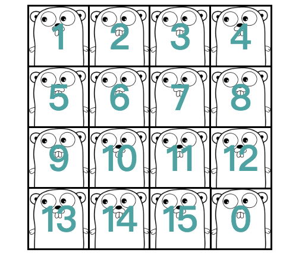
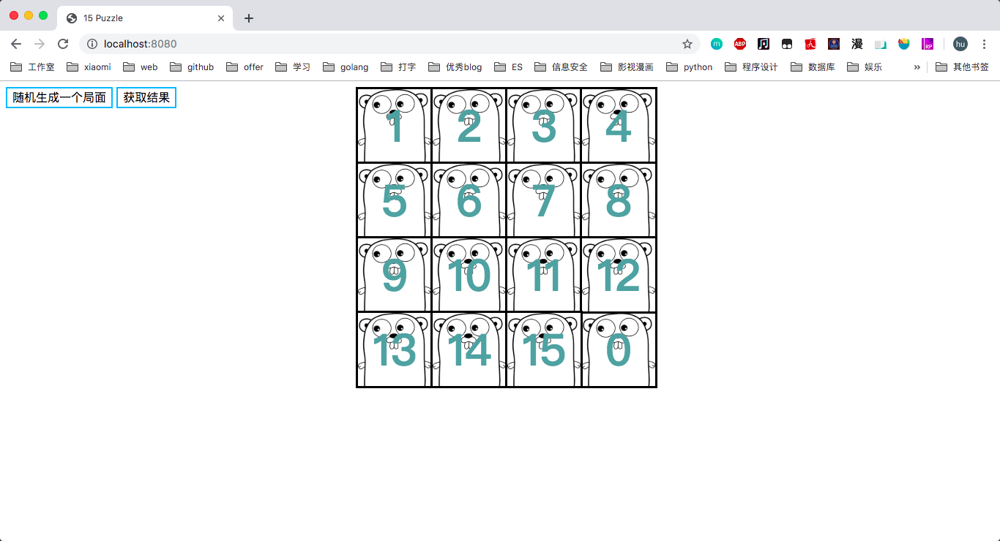
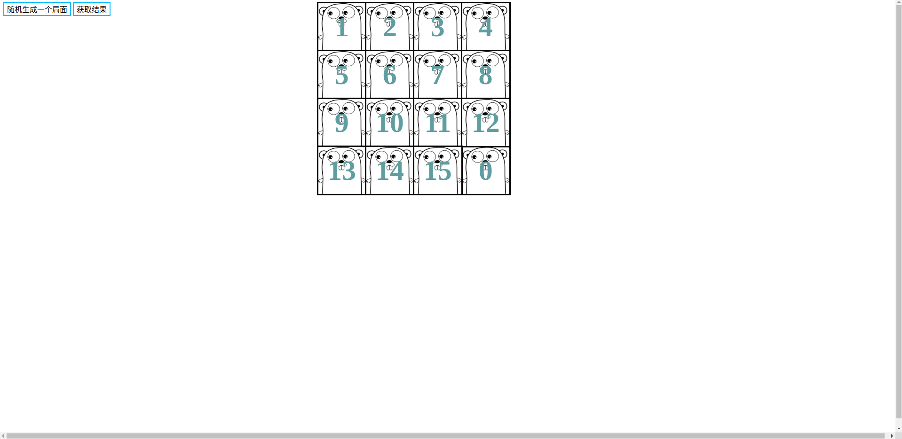

# 15-puzzle

## 问题描述

> 滑块拼图游戏，共 15 个滑块，一个空位，滑块不能取下来，只能通过移动滑块到空位来改变位置，直到滑块按 1-15 、空位结束。



## 题目要求

1. 随机生成 15-PUZZLE 数码棋盘。

2. 检查问题是不是有解。如果无解，输出无解。

3. 如果有解，输出一个 `.txt` 文件。文件把解路径上的每张棋盘都按顺序输出。

4. 或者，写一个带可视化界面的程序，在界面上动态展示解路径。

## 问题求解

> 15 数码状态空间有16!，采用无信息搜索需要耗费大量时间， A\* 算法需要维护 open 表和 close 表，以及排序选择最小代价的结点内存空间消耗过多，采用 IDA* 既节约时间，又减少空间占用（不用判重）。

- 生成棋盘采用 **Fisher–Yates shuffle** 随机洗牌算法
- 判断是否可解: 判断**逆序数**与原来是否相等
- 调整状态使其可解原理: 任意交换两个不为零的数，改变排列逆序数
- 求解时启发函数采用 `4*曼哈顿距离/3`
- 后台编程语言为 `golang`，求解逻辑编写，提供接口及命令行模式
- 前端采用 `js` + `html` + `css`，负责将结果以动画形式呈现

## 使用方式

1. 首先需要本地搭建go环境，拉取代码

   ```shell
   git clone https://github.com/imyhui/15puzzle.git
   ```

   或者

   ```shell
   go get -v github.com/imyhui/15puzzle
   ```

2. 编译

   ```shell
   cd 15puzzle
   go build
   ```

3. 运行

   1. 命令行模式

      ```shell
      ./15puzzle 
      正在求解...,详情见solve.txt
      ```

      等待运行结束，查看 `solve.txt`

      ```shell
      cat solve.txt
      ------------
      |12| 3|14| 0|
      | 9| 8| 4|10|
      | 2|11| 5|13|
      | 7| 6|15| 1|
      -------------
      [12 3 14 0 9 8 4 10 2 11 5 13 7 6 15 1]
      该 puzzle 有解
      解为: DLLLDRRRDLUUULLDRURRDDLULDLDRRUUULDRRDLLLDRRULURDLLURULDRDRDR
      
      cost=[2.430521923s]
      ------------
      |12| 3|14|10|
      | 9| 8| 4| 0|
      | 2|11| 5|13|
      | 7| 6|15| 1|
      -------------
      ------------
      |12| 3|14|10|
      | 9| 8| 0| 4|
      | 2|11| 5|13|
      | 7| 6|15| 1|
      -------------
      ...
      ------------
      | 1| 2| 3| 4|
      | 5| 6| 7| 8|
      | 9|10|11|12|
      |13|14|15| 0|
      -------------
      ```

   2. 服务模式

      ```shell
      ./15puzzle server
      ```

      访问 [localhost:8080](http://localhost:8080)

      

   - 点击随机生成局面，等待局面完成
- 点击获取结果
     - 若局面不可解，弹窗提醒是否调整, 调整后重新点击获取结果即可
     - 也可直接随机生成新局面, 重新求解
   - 查看结果展示动画

## 线上体验

[线上地址](<http://puzzle.andyhui.top/>)



## 参考资料

- [ Go语言圣经（中文版](https://docs.hacknode.org/gopl-zh/)
- [ECMAScript 6 入门](http://es6.ruanyifeng.com/)
- [Fisher–Yates shuffle](https://en.wikipedia.org/wiki/Fisher–Yates_shuffle)
- [15数码介绍](http://www.mathematische-basteleien.de/15puzzle.htm)
- [维基百科—15 puzzle](https://de.wikipedia.org/wiki/15-Puzzle)
- [维基百科—Iterative deepening A*](<https://en.wikipedia.org/wiki/Iterative_deepening_A*>)
- [15 Puzzle有解判断](http://mathworld.wolfram.com/15Puzzle.html)
- [Bernard Bauer，The Manhattan Pair Distance Heuristic for the 15-Puzzle，1994](http://citeseerx.ist.psu.edu/viewdoc/summary?doi=10.1.1.58.7)
- [基于JavaScript求解八数码最短路径并生成动画效果](https://segmentfault.com/a/1190000013026395)
- [《**挑战编程**:程序设计竞赛训练手册》](https://www.baidu.com/s?ie=UTF-8&wd=《挑战编程%3A程序设计竞赛训练手册》) [15puzzle](https://blog.csdn.net/metaphysis/article/details/6560047)
- [利用JavaScript在网页实现八数码启发式A*算法动画效果的图文代码介绍](http://www.php.cn/js-tutorial-360516.html)

- [30种CSS3炫酷页面预加载loading动画特效]([http://www.htmleaf.com/css3/css3donghua/201504151682.html](http://www.htmleaf.com/css3/css3donghua/201504151682.html))
- [菜鸟教程CSS](https://www.runoob.com/css/css-tutorial.html)


Authored by [@imyhui](https://github.com/imyhui/). Maintained by [@imyhui](https://github.com/imyhui/)